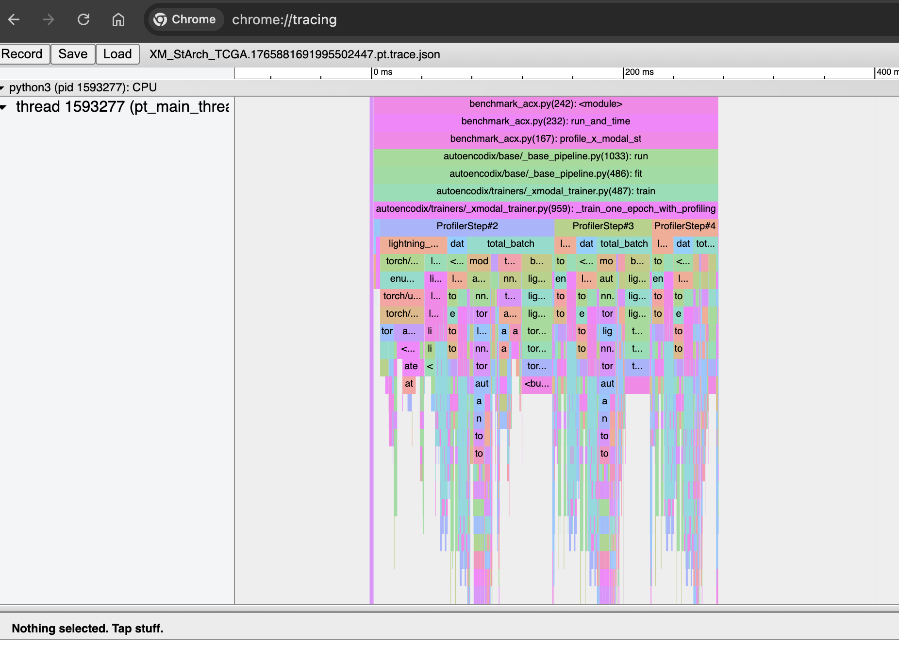

## How to add Profiling to AUTOENCODIX
As of now (16. December 2025), we have the possiblity to profile one epoch of XModalix Trainer. You can:
- activate profiling via the `profiling` config parameter (set to True)
- you can specify a directory where the profiling results should be saved with `profile_logs` config param.
- if you want to profile more code see the end of the file of `_xmodal_trainer.py` for how to add profiling code (method  `_train_one_epoch_with_profiling`)
- this will profile one epoch (first epoch), the print results are already very useful.
- for a more deep dive you can find csv file in the profile_logs folder that you specified
- if you want a more visual insight, you will also find json files in the directory. You can either:
  - use tensorboard to visualize this (have dev dependecies installed) and run `tensorboard --logdir=./profiler_logs/` (image below)
  - or use chrome tracing tool: 1. Open chrome browser, 2. type `chrome://tracing/` 3. upload json

- in `notebooks/sandbox_profiling.py` you find a very messy script how I started the profiling
- on the nextcloud you find sample results:
    https://cloud.scadsai.uni-leipzig.de/index.php/f/22184482

  